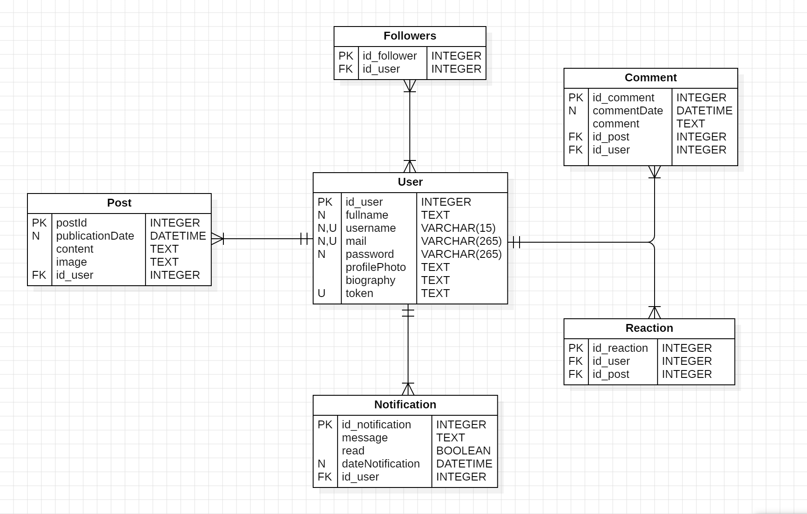
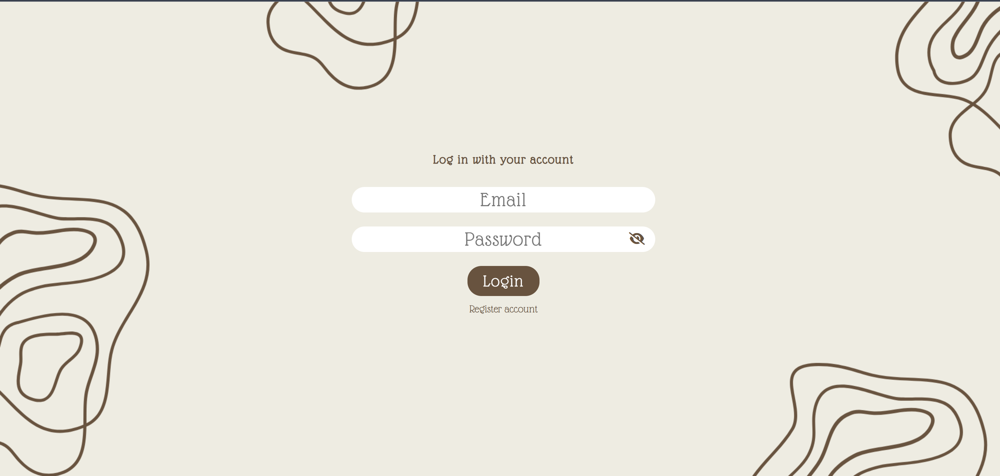
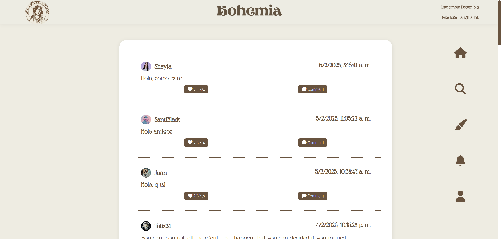
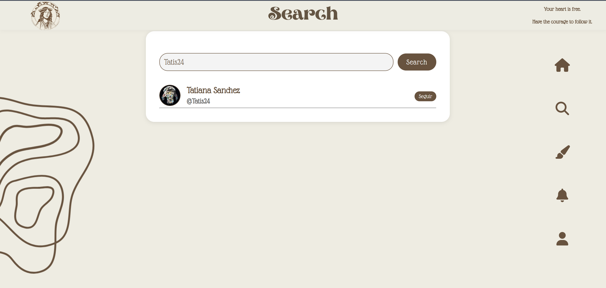
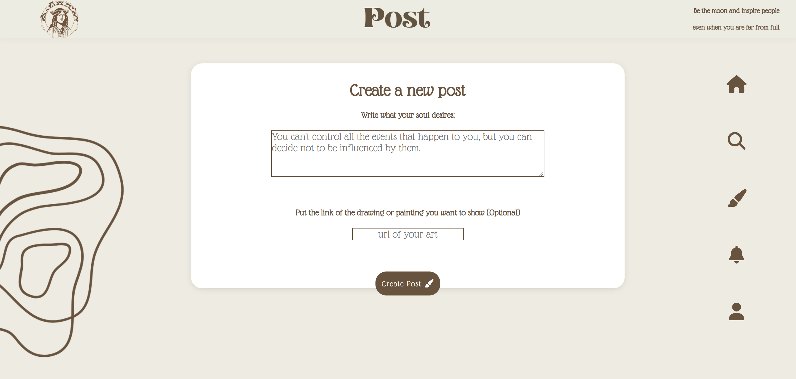
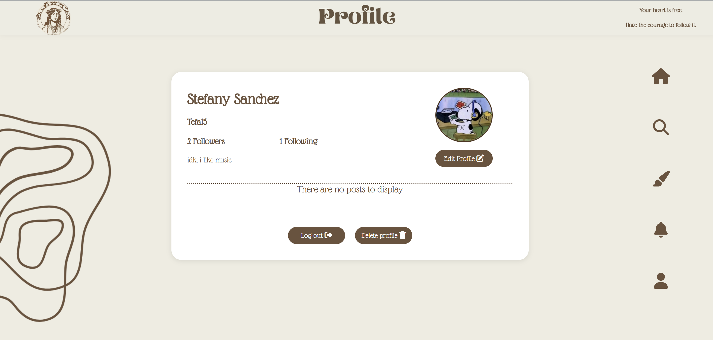

# Bohemia

Bohemia is a social network with a bohemian theme, designed to foster artistic expression, creativity, and meaningful connections. This platform allows users to share their thoughts, artwork, music, and experiences in an inspiring and free-spirited environment.

The frontend of Bohemia is a web application built with HTML, CSS, and JavaScript. It interacts with a RESTful API developed in Spring Boot to provide a seamless and engaging user experience. With a visually captivating interface, Bohemia encourages users to explore, connect, and express themselves in a unique and artistic way.

## Link Backend
https://github.com/Stefanyyy15/Bohemia_BackEnd.git


## Tabla de contenido

| Index | Title |
| ------ | --------------- |
| 1. | Project Description |
| 2. | System Requirements |
| 3. | Installation |
| 4. | Functional Requirements   |
| 5. | ER Diagram |
| 6. | FAQs |
| 7. | License |
| 8. | Contact |

# System Requirements

This project is developed using the following technologies:

- **HTML 5**  
  The standard for structuring web pages, providing the semantics and basic content of the application.

- **CSS**  
    Used for the visual styling of the interface, ensuring that the application is attractive and easy to use.

- **JavaScript**  
  A programming language that enables interface interactivity, making API requests to fetch data and dynamically updating the DOM.

## Requirements to Run the Project

To run this project, make sure you have the following requirements installed on your system:

- **VisualStudio**: [Descargar VisualStudio](https://code.visualstudio.com/download)

(You can use any code editor of your choice.)

- **NetBeans**: [Descargar NetBeans](https://netbeans.apache.org/front/main/download/nb24/)
Required for backend development and integration.

- **Spring Boot**: [Descargar SpringBoot](https://spring.io/projects/spring-boot)
Used to run the backend API of the project.

## Installation

Clone the Project

```bash
git clone https://github.com/Stefanyy15/Bohemia_FrontEnd.git
```

Go to the project directory

```bash
cd Bohemia_FrontEnd
```

Direct to the file

```bash
code .
```

## Functional Requirements  
The following requirements describe what the application must allow users to do.  

### 1. User Management  
A user must be able to register by providing:  
- Full name  
- Unique username  
- Unique email address  
- Secure password  

The system must allow users to log in and log out securely using JWT authentication.  

A user must be able to update their profile by modifying:  
- Full name  
- Biography  
- Profile picture (only via a URL link)  

### 2. Posts  
A user must be able to create a post with:  
- A required text field (minimum 5 characters, maximum 500)  
- An option to add an image via a URL link  

A user must be able to edit and delete their own posts.  

Posts must be displayed in reverse chronological order (most recent first).  

A user can only delete their own posts.  

### 3. Interactions  
A user must be able to comment on other users' posts.  
- Comments have a 300-character limit.  
- A user can only edit and delete their own comments.  

A user must be able to "like" a post (only once per user).  

The total number of reactions and comments must be visible on each post.  

### 4. User Following  
A user must be able to follow and unfollow other users.  

Users must be able to view a list of:  
- Followers (who follows them)  
- Following (who they follow)  

On the home section, only posts from followed users should be displayed.  

### 5. Notifications  
The system must send notifications when:  
- A user receives a comment on their post.  
- A user receives a "like" on their post.  
- A user is followed by another person.  

Notifications must be displayed in a dedicated section and marked as read or unread.  

## Diagram ER



## Tabs






## FAQs
List of frequently asked questions:
1. How can I contribute to the project?
_You can contribute by creating a fork of the repository and sending a pull request._

2. Is this project open for contributions?
| Contribution type | Accepted | Feedback |
|:---------------------|:--------:|------------:|
| Bug reporting | Yes | Use the issues section on GitHub |
| New features | Yes | Send a pull request with your proposals |

## License

This project is licensed under the MIT License.

[](https://choosealicense.com/licenses/mit/)

## Contacto

## Contact

If you have any questions or would like more information, please feel free to contact us:

- **Name**: Michelle Sanchez
- **GitHub**: [https://github.com/miDaya02](https://github.com/miDaya02)

- **Name**: Stefany Sanchez
- **GitHub**: [https://github.com/Stefanyy15](https://github.com/Stefanyy15)

---
